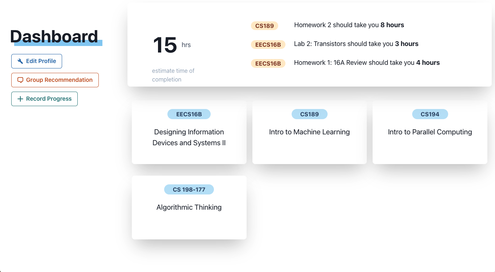
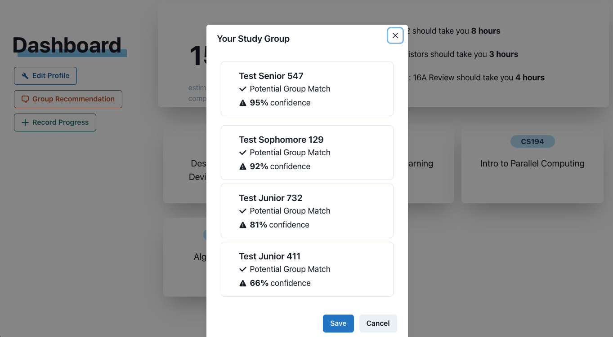
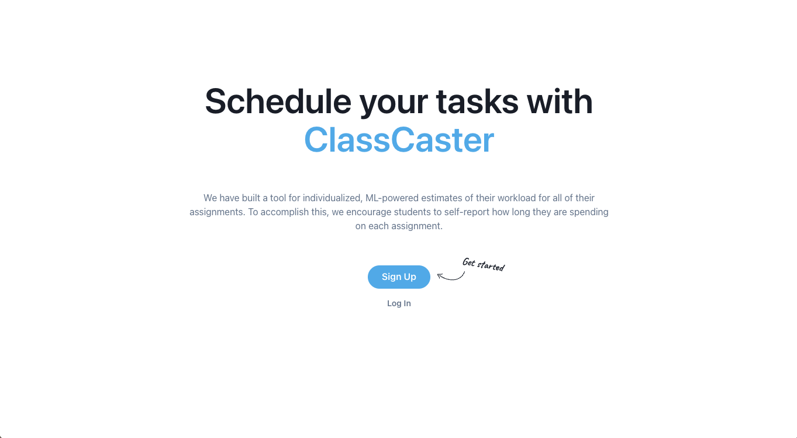

# ClassCaster
**Intelligent, individualized workload forecasting and study group matching.**

[ [Demo Slides](https://docs.google.com/presentation/d/1OMfeJ6QzAl4Fbg8SWP7vFUdR9RNnz5AedljkxL2d4L4/edit?usp=sharing) ] 
[ [HackMIT Closing Ceremony YouTube Link](https://youtu.be/IHncdTUho1g?t=495) ]  
*Since HackMIT 2021 does not use Devpost but their private platform, Spectacle, for proof of awards, please refer to the closing ceremony video at timestamp 8:15 (ML award) and 18:00 (MSFT award), or the screenshots in the demo slides linked above.*

:rocket: &nbsp; **HackMIT 2021** winning project by Kevin Li, Sumer Kohli, and Reina Wang.

- Best Machine Learning Hack
- Microsoft Azure Hack for Social Good

### Demo Screenshots

 
 
